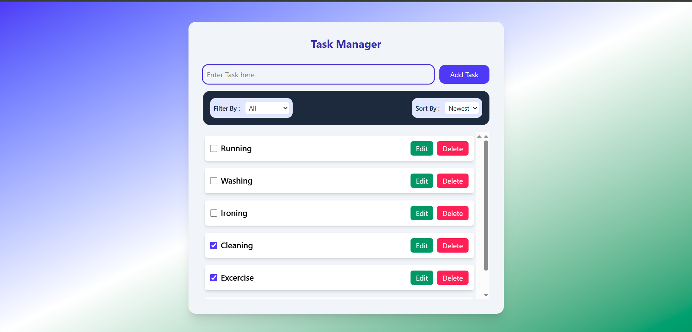

# MERN Task Manager - Frontend

This is the **frontend** of a simple Task Manager application built with **React (Vite bundler)** and styled using **Tailwind CSS**. It allows users to add, edit, delete, sort, and filter tasks with a clean, responsive UI.

---

## 🛠️ How to Run Locally

### ✅ Prerequisites
- Node.js and npm installed

### ✅ Setup Steps

```bash
git clone https://github.com/pranavpallattu/todoFrontend.git
cd todoFrontend
npm install
npm run dev

⚠️ Make sure the backend is running at http://localhost:4000 or your deployed Backend API URL, and update the value in src/services/serverUrl.js accordingly.


📁 Folder Structure

src/
├── components/        # UI Components (Body, TaskForm, FilterBar, TaskContainer, TaskItem)
├── hooks/             # Custom hooks (add, update, delete, toggle)
├── services/          # Axios API functions
├── utils/             # Input validation logic
├── App.jsx            # Main layout


🚀 Design Choices

✅ Tailwind CSS for responsive, utility-first styling

✅ Custom hooks for modular and maintainable logic

✅ SweetAlert2 for consistent user feedback

✅ Axios for REST API calls

✅ Shimmer Loader for better loading UX


🚀 Live Demo

👉 Frontend: https://todo-inky-psi.vercel.app

👉 Backend API: https://todo-server-lj7d.onrender.com


✅ Features

✅ Add new tasks

✅ Edit task title

✅ Toggle complete / incomplete

✅ Delete tasks with confirmation

✅ Filter by All, Completed, or Pending

✅ Sort by Newest or Oldest

✅ SweetAlert popups for actions

✅ Validation for empty task entries

✅ Shimmer loading indicator

## 📸 Screenshot

🚀 Task Manager UI  



🚀 Author -  Pranav P S